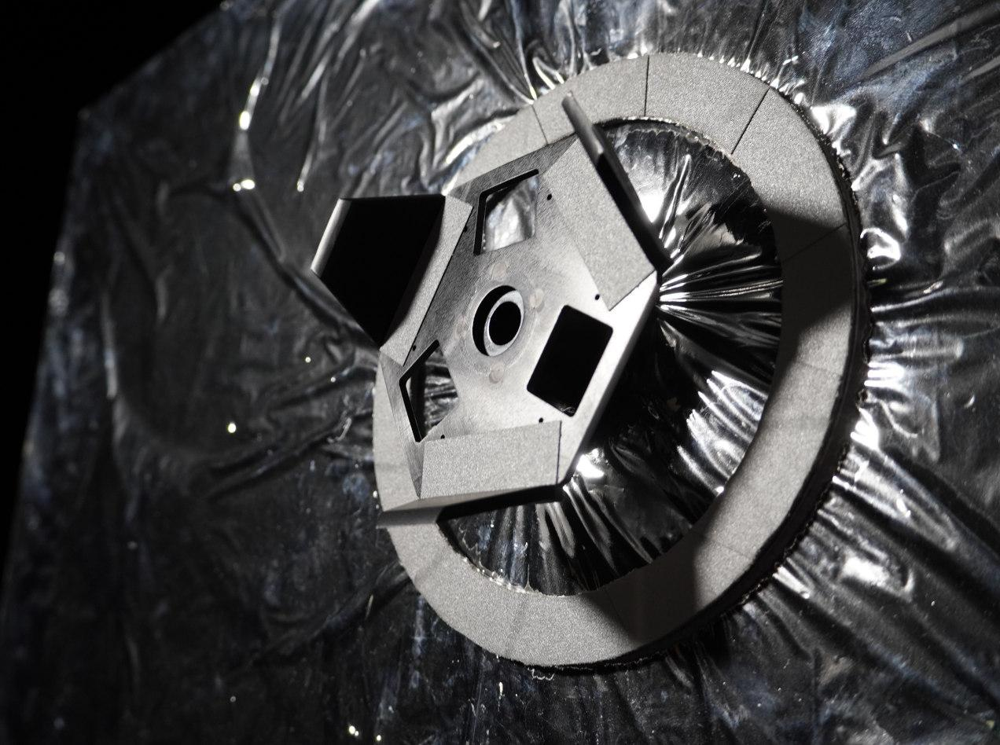

# Satellite Docking using RGB and Event Cameras

## See our project page [here](https://uts-ri.github.io/rgb_event_docking_port/)!



Repository to host the github page associated with our ICRA 2025 paper _Mixing Data-driven and Geometric Models for Satellite Docking Port State Estimation using an RGB or Event Camera_ by Cedric Le Gentil, Jack Naylor, Nuwan Munasinghe, Jasprabhjit Mehami, Benny Dai, Mikhail Asavkin, Donald G. Dansereau, and Teresa Vidal-Calleja.

https://github.com/user-attachments/assets/ba223899-5728-4fbb-ae7d-b526ca6719dc

The preprint is [here](legentil2025mixing.pdf).

For the data, please refer to the github page accessible [here](https://uts-ri.github.io/rgb_event_docking_port/).

If you find this work useful, please cite it as
```bibtex
@inproceedings{legentil2025mixing,
  title={Mixing Data-driven and Geometric Models for Satellite Docking Port State Estimation using an {RGB} or Event Camera},
  author={Cedric Le Gentil and Jack Naylor and Nuwan Munasinghe and Jasprabhjit Mehami and Benny Dai and Mikhail Asavkin and Donald G. Dansereau and Teresa Vidal-Calleja},
  booktitle={International Conference on Robotics and Automation ({ICRA})},
  year={2025}
}
